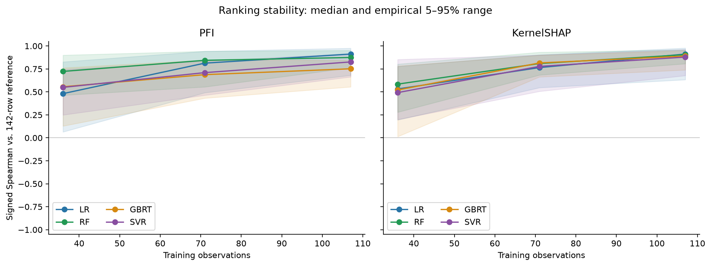
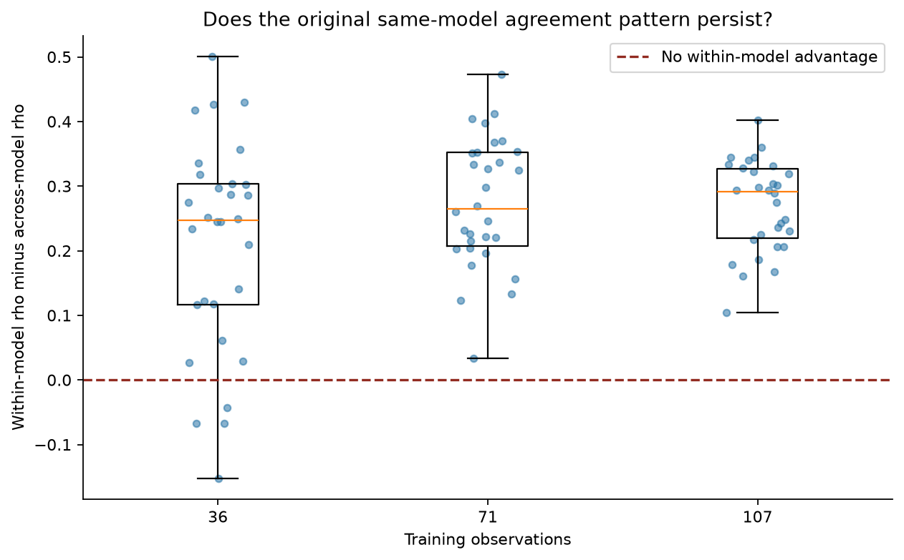
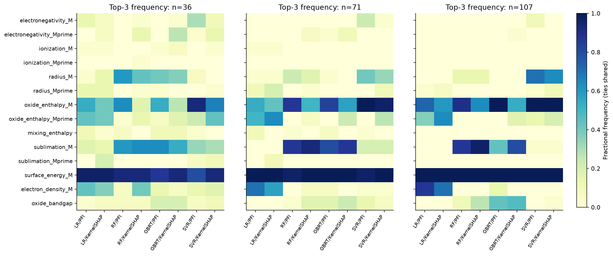

# 训练样本改变后，特征重要性结论还成立吗？

在 MSI 材料黏附能数据上，固定模型参数与评估集，反复更换、减少训练样本，检查排名、解释方法一致性和关键特征。

- **排名随样本量增加而更接近参考。** 八条流程的 Spearman 中位数从 n=36 的 0.481–0.723，提高到 n=107 的 0.752–0.912；142 条训练所得排名只是比较参考，不是真实重要性。
- **“同模型内解释更一致”在小样本下会失效。** n=36 时，30 轮中 26 轮差值为正、4 轮为负；n=71、107 时各为 30/30 轮为正。
- **金属表面能持续进入重要特征前三。** `surface_energy_M` 的 Top-3 频率为 80%–100%，但重要性稳定不能证明因果机制。

| 排名是否保持 | 同模型内解释是否更一致 | 表面能是否持续重要 |
|---|---|---|
|  |  |  |

先看 [中文报告](results/full/report_zh.md)，再看 [已执行的分析 notebook](analysis.ipynb)。完整分布与性能图见 [结果图目录](results/full/figures)。

## 与原研究的关系

论文：*Familywise Feature Importance Stability in Chemical and Materials Machine Learning*，DOI [10.1021/acs.jcim.6c00893](https://doi.org/10.1021/acs.jcim.6c00893)。数据与固定超参数来自 [原作者仓库](https://github.com/Andy-lucky2005/feature_importance_analysis)，本项目固定使用 [c17c6832e5d18d66f059ba863375161490775f96](https://github.com/Andy-lucky2005/feature_importance_analysis/tree/c17c6832e5d18d66f059ba863375161490775f96)。来源文件哈希见 [source.json](provenance/source.json)。

这是围绕训练样本敏感性的缩减实验：LR、RF、GBRT、SVR × PFI、KernelSHAP，共 **4 个模型、8 条解释流程**。按模型预先分组；未重建原文全部 26 条流程、9 个事后相关性组或 W 统计量。

## 实验怎样进行

178 条唯一记录、14 个主描述符；142 条训练池与 36 条固定评估数据。每轮从训练池生成嵌套的 36、71、107 条子集，共 30 轮，同轮各模型使用相同记录；加上四个 142 条参考模型，共 364 次拟合。标准化仅拟合当前训练子集。

PFI 保留负重要性，置换重复 30 次；KernelSHAP 使用固定的 20 条背景数据，本次预算经 512/1024 校准后选择 512。并列排名用平均秩，Top-3 边界并列按份额计数。

解释一致性差值为：四模型各自 PFI–SHAP 排名相关的平均，减去 PFI、SHAP 各自六个跨模型配对相关的等权平均。差值中位数随训练量为 0.247、0.264、0.291；n=36 的经验 5–95% 范围为 [-0.067, 0.428]。

这些结果描述**固定数据池、评估划分、参数和背景下的条件抽样敏感性**。5–95% 范围是经验波动，不是总体置信区间；未研究噪声、材料类别分布偏移或因果关系。上游参数可能利用全数据选定，MAE/R²作为辅助诊断。

## 查看保存结果与重新训练

公开版本含代码、配置、测试、依赖、notebook、报告、5 张 PNG、6 个 CSV、完整实验的 manifest/completion/verification，以及试跑 manifest/completion/calibration。原始 XLSX、原论文 PDF、复制的上游 Python 文件、学习与个人记录、缓存和逐次检查点未打包。`source.json` 中上游 Python 文件的哈希仅用于来源记录。

**只查看结果无需 XLSX 或检查点。** GitHub 可直接查看 notebook；本地从项目根目录打开 `analysis.ipynb`，选择项目 `.venv` 的 Python 内核并运行全部单元格。它读取保存的 CSV、完成标记、图片和报告。

本次环境为 Python 3.12；项目要求 Python ≥3.11。Windows PowerShell 安装并查看 CSV：

```powershell
python -m venv .venv
& .\.venv\Scripts\python.exe -m pip install -r requirements-lock.txt
& .\.venv\Scripts\python.exe -c "import pandas as pd; d=pd.read_csv('results/full/family.csv'); print(d.groupby('size').delta.agg(['median','min','max']))"
```

命令行执行 notebook 的方法及原始数据下载、SHA-256 校验见 [数据与复现说明](data/README.md)。Linux/macOS 使用 `.venv/bin/python`。

**重新训练需先取得数据。** 下载并校验后，在项目根目录运行：

```powershell
& .\.venv\Scripts\python.exe -m pytest -q
& .\.venv\Scripts\python.exe -u run_experiment.py --config docs/reproduce.yaml --stage all
```

测试中有依赖原始 XLSX 的项目。[复现配置](docs/reproduce.yaml) 将新输出写入 `results/reproduction/`；完整运行会重新生成根目录的 `analysis.ipynb`，使其指向 `results/reproduction/full/`。再次运行相同命令可复用新产生的检查点；改变科学配置时应另选输出目录。

`--stage analysis` 需要对应原始 XLSX 和全部 364 个完整实验检查点；公开包不能仅靠保存 CSV 执行该阶段。查看 CSV 与 notebook 可直接完成；重建全部图表需先运行完整实验。

## 贡献说明

研究问题由仓库作者提出；代码实现、实验运行与结果整理由 AI 协助完成。数据与原研究思路归属上文列出的论文及仓库来源。
