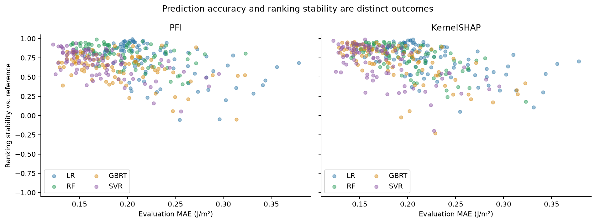

# 训练数据变化下的特征重要性稳定性：MSI 实验报告

## 实验设置

完成 364 次训练，4个模型 × 两种共同解释方法。训练池142条，固定评估集36条；
抽样设置：36条×30次，71条×30次，107条×30次。KernelSHAP预算为512，背景20条，PFI重复30次。
模型参数来自原仓库并固定；标准化只在当前训练子集拟合。100%模型只作为参考。

## 1. 换训练样本后，排名是否保持？

下表为相对142条参考模型的带符号Spearman中位数。1表示排名相同，负值表示倾向反向。

| 模型 / 方法 | n=36 | n=71 | n=107 |
|---|---:|---:|---:|
| GBRT / KernelSHAP | 0.521 | 0.815 | 0.890 |
| GBRT / PFI | 0.556 | 0.688 | 0.752 |
| LR / KernelSHAP | 0.532 | 0.765 | 0.912 |
| LR / PFI | 0.481 | 0.813 | 0.912 |
| RF / KernelSHAP | 0.585 | 0.809 | 0.905 |
| RF / PFI | 0.723 | 0.844 | 0.875 |
| SVR / KernelSHAP | 0.492 | 0.778 | 0.879 |
| SVR / PFI | 0.549 | 0.710 | 0.826 |

完整特征排名中位数、IQR和5–95%范围见 feature_summary.csv。小样本重复抽样的排名波动描述了对训练样本选择的敏感性。

## 2. “同一模型内解释方法更一致”是否保持？

差值 = 4个模型内部PFI–SHAP相关性的均值 − 两种解释方法各自跨模型6个配对相关性的等权均值。

| 训练样本 | 差值中位数 | 经验5–95%范围 | 差值为正的比例 | 判断 |
|---|---:|---|---:|---|
| 36 | 0.247 | [-0.067, 0.428] | 86.7% | 结论依赖训练样本，不能认为普遍保持 |
| 71 | 0.264 | [0.127, 0.409] | 100.0% | 本档抽样支持原定性结论 |
| 107 | 0.291 | [0.164, 0.353] | 100.0% | 本档抽样支持原定性结论 |

## 3. 表面能是否持续重要？

下表为 surface_energy_M 进入前三的频率；边界并列时按比例分配，所有模型分别报告。

| 模型 / 方法 | n=36 | n=71 | n=107 |
|---|---:|---:|---:|
| GBRT / KernelSHAP | 93.3% | 100.0% | 100.0% |
| GBRT / PFI | 86.7% | 100.0% | 100.0% |
| LR / KernelSHAP | 96.7% | 100.0% | 100.0% |
| LR / PFI | 96.7% | 100.0% | 100.0% |
| RF / KernelSHAP | 93.3% | 100.0% | 100.0% |
| RF / PFI | 93.3% | 96.7% | 100.0% |
| SVR / KernelSHAP | 93.3% | 100.0% | 100.0% |
| SVR / PFI | 80.0% | 96.7% | 100.0% |

## 4. 预测性能与稳定性

MAE/R²完整结果见 performance.csv；表现差的模型也保留。稳定排名不等于模型正确。

## 结论范围与复现

- 本研究回答固定MSI数据池、评估划分、模型参数和解释背景下的训练样本敏感性。
- 本项目按模型预先分组；并未重建原文九个事后相关性组，也没有复现全部26条解释流程。
- 原文参数可能已利用全数据选出，MAE/R²是辅助诊断，不是完全独立的泛化评估。
- 5–95%是重复抽样的经验波动范围，不是总体置信区间；重复抽样不是相互独立的新材料数据集。
- 当前未研究材料类别偏移、噪声或因果机制；固定SHAP背景来自训练池，可能不包含在某一小训练子集中。
- 未定义相关性显式标记，不删除弱模型或静默改变比较成员。
- 数据及参数出处、哈希与软件版本见 provenance/source.json、manifest.json和requirements-lock.txt。

本公开版本提供已保存的 CSV、图表与分析 notebook，不包含逐次训练检查点。查看保存结果无需原始数据；重跑实验及重建图表请按[项目复现说明](../../README.md)取得原始数据并使用 `docs/reproduce.yaml` 运行 `--stage all`。
